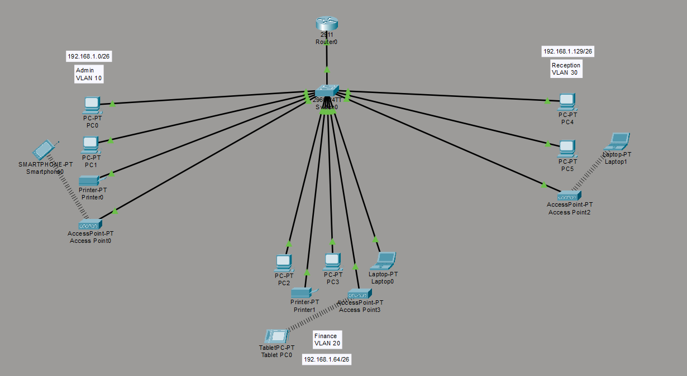
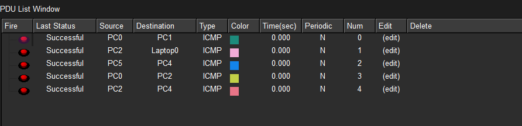

# soho-branch-network
Design and implementation of a branch office network in Cisco Packet Tracer using VLAN segmentation, router-on-a-stick inter-VLAN routing, DHCP services, and wireless integration to ensure secure, scalable, and efficient departmental communication.

## TITLE SECTION
Project title: Inter-VLAN Routing and DHCP Configuration for Branch Office  
Author: Thato Maputla  
Date: 25 February 2026

### OVERVIEW
This project involved designing and implementing a branch office network using Cisco Packet Tracer to operate independently from the headquarters network. The design adhered to specific requirements, including the use of one router and one switch, segmentation of three departments into separate VLANs, and the provision of wireless connectivity for each department.  
 
To ensure efficient IP management, DHCP services were configured on the router through CLI, with distinct pools created for each VLAN to enable automatic IPv4 address allocation. Inter-VLAN routing was implemented via router sub-interfaces, allowing seamless communication between departments while maintaining logical separation.  
 
On the switch, trunking was configured to support multiple VLANs across the router connection, and access ports were assigned to their respective VLANs. Wireless networks were integrated for each department, ensuring mobility and accessibility for users. 
 
The final network design successfully demonstrated:
1. VLAN segmentation for departmental isolation.
2. Dynamic IP allocation through DHCP.
3. Inter-VLAN communication via router-on-a-stick configuration.
4. Wireless integration for user connectivity.
5. Scalable and secure branch office network design aligned with organizational requirements.

### OBJECTIVES
The objective of this project was to design and implement a branch office network that operates independently from the headquarters while ensuring secure, efficient, and scalable communication among departments. The network needed to meet the following requirements:
1. Use of a single router and switch for core connectivity.
2. Segmentation of three departments into separate VLANs, each with its own wireless network.
3. Automatic IPv4 address allocation through DHCP.
4. Seamless inter-departmental communication via inter-VLAN routing.

### NETWORK TOPOLOGY (Star)
The network design follows a star topology, with a central switch connecting all departmental devices and linking to a single router that provides inter-VLAN routing and DHCP services. This physical topology ensures scalability, ease of management, and fault isolation.  

Core Devices:
1. Cisco Router 2911 configured with sub-interfaces for VLANs, enabling inter-VLAN communication (router-on-a-stick).
2. Cisco Switch 2916 IOS15 serving as the central hub, configured with trunking to carry multiple VLANs between the router and the switch.

Logical Segmentation:
1. Three VLANs were implemented: Admin (VLAN 10), Finance (VLAN 20), and Reception (VLAN 30).
2. Each VLAN was assigned a unique IP subnet and a DHCP pool for automatic IPv4 address allocation.
3. Wireless access points were integrated into each VLAN, extending connectivity to mobile and wireless devices.

Communication:
1. Inter-VLAN routing allows seamless communication between departments while maintaining logical separation.
2. DHCP ensures dynamic IP assignment, reducing administrative overhead and improving efficiency.  

 

### SUBNETTING
Provided network: 192.168.1.0  
This is a class C network, making the subnet mask: 255.255.255.0
Number of subnets required: 3  

//formula for calculating subnets:  
//2^n = 3 (or more)  
//solving for n we get: n = 2  
//given n = 2; this will represent borrowed bits  
//11111111.11111111.11111111.11000000  
//255.255.255.192 = Subnet mask with block size of 64  

First Subnet (VLAN 10):  
Subnet mask = 255.255.255.192  
Network ID = 192.168.1.0  
CIDR notation = 192.168.1.0/26  
Valid host range = 192.168.1.1 -> 192.168.1.62  
Broadcast ID = 192.168.1.63  

Second Subnet (VLAN 20):  
Subnet mask = 255.255.255.192  
Network ID = 192.168.1.64  
CIDR notation = 192.168.1.64/26  
Valid host range = 192.168.1.65 -> 192.168.1.126  
Broadcast ID = 192.168.1.127  

Third Subnet (VLAN 30):  
Subnet mask = 255.255.255.192  
Network ID = 192.168.1.128  
CIDR notation = 192.168.1.128/26  
Valid host range = 192.168.1.129 -> 192.168.1.190  
Broadcast ID = 192.168.1.191  

###IP ADDRESSING SCHEME

| VLAN   | Department | Subnet Mask       | Network ID     | CIDR Notation   | Valid Host Range         | Broadcast Address |
|--------|------------|-------------------|----------------|-----------------|--------------------------|------------------|
| VLAN 10| Admin      | 255.255.255.192   | 192.168.1.0    | 192.168.1.0/26  | 192.168.1.1 – 192.168.1.62 | 192.168.1.63   |
| VLAN 20| Finance    | 255.255.255.192   | 192.168.1.64   | 192.168.1.64/26 | 192.168.1.65 – 192.168.1.126 | 192.168.1.127 |
| VLAN 30| Reception  | 255.255.255.192   | 192.168.1.128  | 192.168.1.128/26| 192.168.1.129 – 192.168.1.190 | 192.168.1.191 |

### Sub-Interface Setup
| VLAN   | Sub-Interface | Encapsulation | IP Address        | Subnet Mask       |
|--------|---------------|---------------|------------------|-------------------|
| VLAN 10 (Admin)    | Gig0/0.10 | dot1Q 10 | 192.168.1.1      | 255.255.255.192   |
| VLAN 20 (Finance)  | Gig0/0.20 | dot1Q 20 | 192.168.1.65     | 255.255.255.192   |
| VLAN 30 (Reception)| Gig0/0.30 | dot1Q 30 | 192.168.1.129    | 255.255.255.192   |

### DHCP Pool Setup
| VLAN   | Pool Name       | Network Address   | Default Gateway | DNS Server       | Domain Name   |
|--------|-----------------|-------------------|-----------------|-----------------|---------------|
| VLAN 10 (Admin)    | Admin-Pool     | 192.168.1.0/26    | 192.168.1.1      | 192.168.1.1   | Admin.com     |
| VLAN 20 (Finance)  | Finance-Pool   | 192.168.1.64/26   | 192.168.1.65     | 192.168.1.65  | Finance.com   |
| VLAN 30 (Reception)| Reception-Pool | 192.168.1.128/26  | 192.168.1.129    | 192.168.1.129 | Reception.com |

---

## Switch Configuration

### VLAN Assignments
| VLAN   | Department | VLAN ID | Assigned Ports |
|--------|------------|---------|----------------|
| VLAN 10| Admin      | 10      | Fa0/1 – Fa0/5  |
| VLAN 20| Finance    | 20      | Fa0/6 – Fa0/10 |
| VLAN 30| Reception  | 30      | Fa0/11 – Fa0/15 |

### Trunk Port Setup
| Interface | Mode  | Allowed VLANs |
|-----------|-------|---------------|
| Fa0/24    | Trunk | 10, 20, 30    |

---

Notes !!!  
- **Router-on-a-stick** was used to enable inter-VLAN routing.  
- Each VLAN has its own **DHCP pool**, ensuring automatic IP assignment.  
- The switch was configured with **access ports** for departmental devices and a **trunk port** to the router.  
- Wireless access points were mapped to their respective VLANs, extending connectivity to mobile devices.  

### CLI CONFIGURATION  (sanitized)
1. Switch:
Switch>en  
Switch#conf t  
Switch(config)#int range fa0/2-5  
Switch(config-if-range)#switchport mode access  
Switch(config-if-range)#switchport access vlan 10  
Switch(config-if-range)#int range fa0/6-10  
Switch(config-if-range)#switchport mode access  
Switch(config-if-range)#switchport access vlan 20  
Switch(config-if-range)#int range fa0/11-13  
Switch(config-if-range)#switchport mode access  
Switch(config-if-range)#switchport access vlan 30  
Switch(config-if-range)#do wr  
Switch(config-if-range)#exit  
Switch(config-if-range)#  
Switch(config-if-range)#int fa0/1  
Switch(config-if-range)#switchport mode trunk  
Switch(config-if-range)#do wr  

2. Router: 
Router>en  
Router#conf t  
Router(config)#int gig0/0  
Router(config-if)#no sh  
Router(config-if)#do wr  
Router(config-if)#exit  

//In order to make the devices across the VLANs to be able to communicate with each other, I'll configure the router through inter-VLAN to create sub-interfaces for the different VLANs. Each sub-interface will contain an IP address, which will be used as a default gateway for its respective VLAN.  

Router(config)#it gig0/0.10  
Router(config-subif)#encapsulation dot1Q 10  
Router(config-subif)#ip address 192.168.1.1 255.255.255.192  
Router(config-subif)#do wr  
Router(config-subif)#exit  
Router(config)#it gig0/0.20  
Router(config-subif)#encapsulation dot1Q 20  
Router(config-subif)#ip address 192.168.1.65 255.255.255.192  
Router(config-subif)#do wr  
Router(config-subif)#exit  
Router(config)#it gig0/0.30  
Router(config-subif)#encapsulation dot1Q 30  
Router(config-subif)#ip address 192.168.1.129 255.255.255.192  
Router(config-subif)#do wr  
Router(config-subif)#exit  

//Configuring the DHCP server. The reason is to ensure that the devices in each VLAN obtain IPv4 automatically.  

Router(config)#service dhcp  
Router(config)#ip dhcp pool Admin-Pool  
Router(dhcp-config)#network 192.168.1.0 255.255.255.192  
Router(dhcp-config)#default-router 192.168.1.1  
Router(dhcp-config)#dns-server 192.168.1.1  
Router(dhcp-config)#domain-name Admin.com  
Router(dhcp-config)#exit  
Router(config)#  
Router(config)#ip dhcp pool Finance-Pool  
Router(dhcp-config)#network 192.168.1.64 255.255.255.192  
Router(dhcp-config)#default-router 192.168.1.65  
Router(dhcp-config)#dns-server 192.168.1.65  
Router(dhcp-config)#domain-name Finance.com  
Router(dhcp-config)#exit  
Router(config)#  
Router(config)#ip dhcp pool Reception-Pool  
Router(dhcp-config)#network 192.168.1.128 255.255.255.192  
Router(dhcp-config)#default-router 192.168.1.129  
Router(dhcp-config)#dns-server 192.168.1.129  
Router(dhcp-config)#domain-name Reception.com  
Router(dhcp-config)#exit  
Router(config)#do wr  

### ACCESS POINTS CONFIGURATION
The access points were configured manually to provide a wireless network for the users.

### TESTING & VERIFICATION
1. Ping within VLAN: PC0 -> PC1 (successful local VLAN communication)
2. Ping across VLANs: PC0 Admin -> PC2 Finance -> PC4 Reception (successful inter-VLAN routing)
3. Ping router gateways (DHCP default gateway is reachable)
4. Ping wireless devices (Successful wireless integration)
5. Ping Printers (successful DHCP assignment and connectivity for non-PC devices

### CONCLUSION
This project successfully demonstrated the design and implementation of a branch office network using Cisco Packet Tracer. By applying a star topology with VLAN segmentation, router-on-a-stick inter-VLAN routing, and DHCP services, the network met all organizational requirements:
1. Logical separation of departments through VLANs.
2. Dynamic IP allocation via DHCP pools for each subnet.
3. Wireless integration ensures mobility and accessibility for users.
4. Inter-VLAN communication enabling seamless collaboration across departments.
5. Scalability and security through structured addressing and trunking configuration.

The outcome highlights practical skills in router and switch configuration, VLAN design, DHCP setup, and network simulation. Overall, the project reflects a well-structured, efficient, and secure branch office network that can be adapted to real-world scenarios.
